# 🚌 TransitWehh

> Real-time Malaysian public transport analytics dashboard — ridership trends, ML forecasting, anomaly detection, and storytelling insights. No login required.


---

## 📖 Table of Contents

- [Overview](#-overview)
- [Features](#-features)
- [Tech Stack](#-tech-stack)
- [Architecture](#-architecture)
- [User Flow](#-user-flow)
- [API Structure](#-api-structure)
- [Frontend Components](#-frontend-components)
- [Feature Flows](#-feature-specific-flows)
- [Getting Started](#-getting-started)
- [Environment Variables](#-environment-variables)
- [Deployment](#-deployment)
- [Project Structure](#-project-structure)
- [Roadmap](#-roadmap)
- [License](#-license)

---

## 🧭 Overview

TransitWehh is a production-quality analytics dashboard for Malaysian public transport — 13 rail and bus services tracked daily from 2019 to present. It goes beyond simple charts: messy data is cleaned and documented, ridership trends are forecasted with Prophet, anomalies are flagged with incident context, and a live crowd nowcast estimates current density. The goal is a dashboard a transit researcher or daily commuter can actually rely on.

**Type:** `Solo`
**Brand:** `Wehh Series`
**Data Source:** [data.gov.my](https://data.gov.my) — Malaysian Government Open Data (no API key required)

> No user accounts. No personal data collected. Read-only public data dashboard.

---

## ✨ Features

- ✅ Daily ridership for 13 transport services (LRT, MRT, KTM, Monorail, Rapid buses) from 2019
- ✅ Prophet ML forecasting with Malaysian public holidays + rain as exogenous regressor
- ✅ IQR and z-score anomaly detection (weekday/weekend-aware) with incident context tooltips
- ✅ STL seasonal decomposition (trend, seasonality, residual)
- ✅ Walk-forward backtesting with MAPE/RMSE — leakage-free, floored MAPE for near-zero days
- ✅ Event Study — structural break analysis (e.g. MRT Putrajaya opening impact)
- ✅ Rain correlation — dual-axis chart + Pearson r, 5-provider weather fallback chain
- ✅ Crowd nowcast — DOW × hour density estimate, holiday-aware grey-out
- ✅ Auto-generated narrative insights (growth, anomalies, composition)
- ✅ My50 "Balik Modal" calculator — break-even day for the RM50 monthly pass
- ✅ Data completeness Gantt — null coverage per service from launch date
- ✅ CSV export with human-readable column names
- ✅ Dark mode toggle, skeleton loading, chart PNG download
- ✅ Stale-while-revalidate cache — dashboard never crashes on upstream failure
- 🚧 KTMB deep-dive monthly breakdown *(in progress)*
- 💡 Fare hike impact study *(planned)*
- 💡 Inter-service transfer correlation *(planned)*

---

## 🛠 Tech Stack

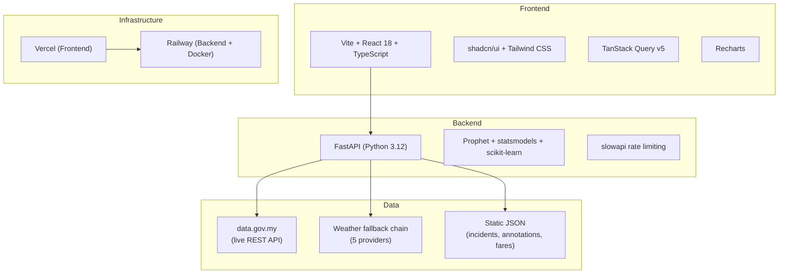

| Layer | Technology |
|---|---|
| Frontend | Vite + React 18 + TypeScript |
| UI | shadcn/ui + Tailwind CSS + Recharts |
| State | TanStack Query v5 |
| Backend | FastAPI (Python 3.12) |
| ML / Analytics | Prophet, statsmodels (STL), scikit-learn, scipy |
| Cache | aiocache (in-memory, stale-while-revalidate) |
| Rate Limiting | slowapi (tiered: 60/30/10 req/min) |
| Logging | structlog (JSON in prod, readable in dev) |
| Hosting | Vercel (frontend) + Railway (backend, Dockerized) |

---

## 📌 Architecture

### High-level Architecture

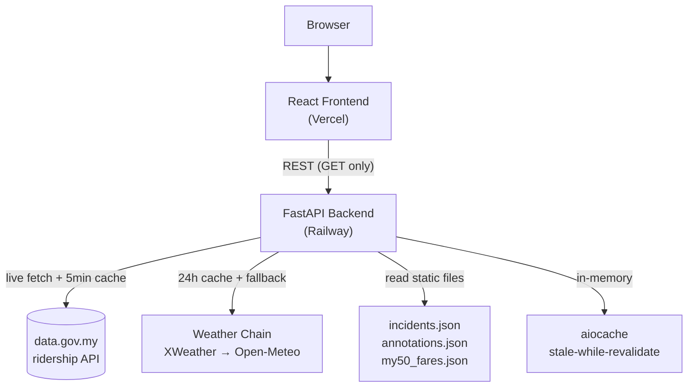

### Request Lifecycle

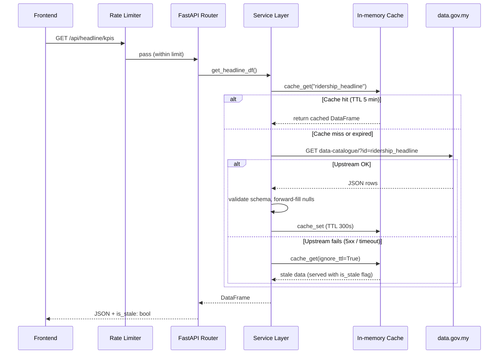

---

## 👤 User Flow

No authentication — the dashboard is fully public and read-only.

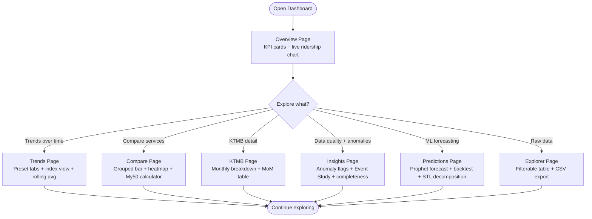

### Page Map

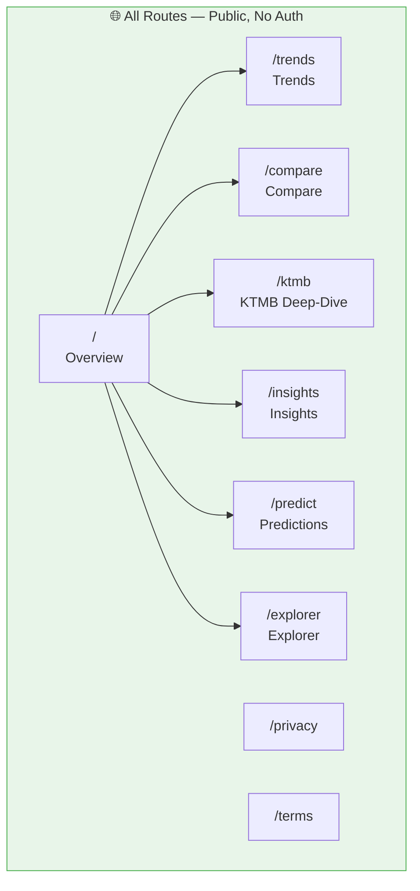

### Wireframe Overview

```mermaid
graph TD
    subgraph Overview ["📄 Overview (/)"]
        O1["DataFreshnessBanner (conditional)"]
        O2["Header + NowcastBadge"]
        O3["KPI Row — Week / Month / MoM / Rail Share"]
        O4["MultiLineChart — preset tabs (Top4/All Rail/KTMB/Bus/All)"]
        O5["ServiceCard grid — all 13 services with sparklines"]
        O1 --> O2 --> O3 --> O4 --> O5
    end

    subgraph Insights ["📄 Insights (/insights)"]
        I1["InsightCard grid — auto-generated narrative"]
        I2["AnomalyFlag chart — IQR / Z-score toggle"]
        I3["EventStudyChart — service selector + verdict"]
        I4["QualityStats — null coverage progress bars"]
        I1 --> I2 --> I3 --> I4
    end

    subgraph Predictions ["📄 Predictions (/predict)"]
        P1["Controls — service / horizon / rain toggle"]
        P2["ForecastChart — actual + yhat + CI band"]
        P3["ModelHealthBadge + backtest window table"]
        P4["DecompositionChart — 4-panel STL"]
        P5["RainCorrelationChart — dual-axis + Pearson r"]
        P1 --> P2 --> P3 --> P4 --> P5
    end
```

---

## 🔌 API Structure

> 20 endpoints across 5 domains — read-only, CORS locked to frontend URL.

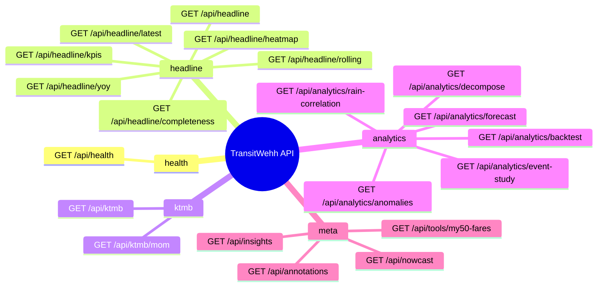

### Rate Limits

| Tier | Endpoints | Limit |
|---|---|---|
| **EXEMPT** | `/api/health` | No limit (Railway health check pings every 10–30s) |
| General | `/api/headline/*`, `/api/ktmb/*`, `/api/nowcast`, `/api/insights`, `/api/annotations` | 60 / minute |
| Moderate | `/api/analytics/anomalies`, `/api/analytics/decompose`, `/api/analytics/event-study`, `/api/analytics/rain-correlation` | 30 / minute |
| Heavy | `/api/analytics/forecast`, `/api/analytics/backtest` | 10 / minute (Prophet compute) |

---

## 🧩 Frontend Components

### Component Tree

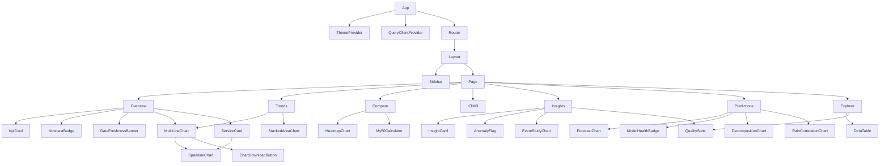

### Key Components

| Component | Purpose |
|---|---|
| `MultiLineChart` | Main ridership chart — preset tabs, annotation markers, rolling avg overlay, index normalization |
| `ForecastChart` | Prophet output — solid actual, dashed forecast, CI shaded area, training cutoff line |
| `AnomalyFlag` | ComposedChart with ridership line + anomaly scatter dots, incident tooltip on hover |
| `EventStudyChart` | Pre/post shaded windows, verdict callout with p-value and % change |
| `HeatmapChart` | Custom SVG 7×12 DOW × Month heatmap with blue intensity scale |
| `DecompositionChart` | 4-panel STL output (observed, trend, seasonal, residual) |
| `RainCorrelationChart` | Dual Y-axis: ridership + precipitation bars, Pearson r header |
| `NowcastBadge` | Live crowd density dot — green/yellow/red, greys out on public holidays |
| `ModelHealthBadge` | MAPE badge (green <10% / yellow <20% / red ≥20%) with "how calculated" tooltip |
| `DataFreshnessBanner` | Yellow warning when last data point is >3 days old |
| `My50Calculator` | Break-even day calculator for the RM50 Prasarana monthly pass |
| `DataTable` | Filterable, paginated headline table with CSV export (human-readable column names) |
| `ChartDownloadButton` | `html-to-image` PNG capture at 2× pixel ratio |

---

## ⚙️ Feature-specific Flows

### Prophet Forecast Flow

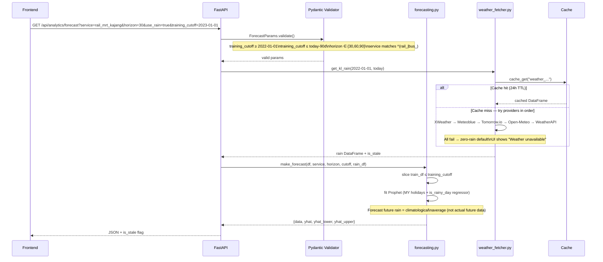

### Backtest Startup Warm-up Flow

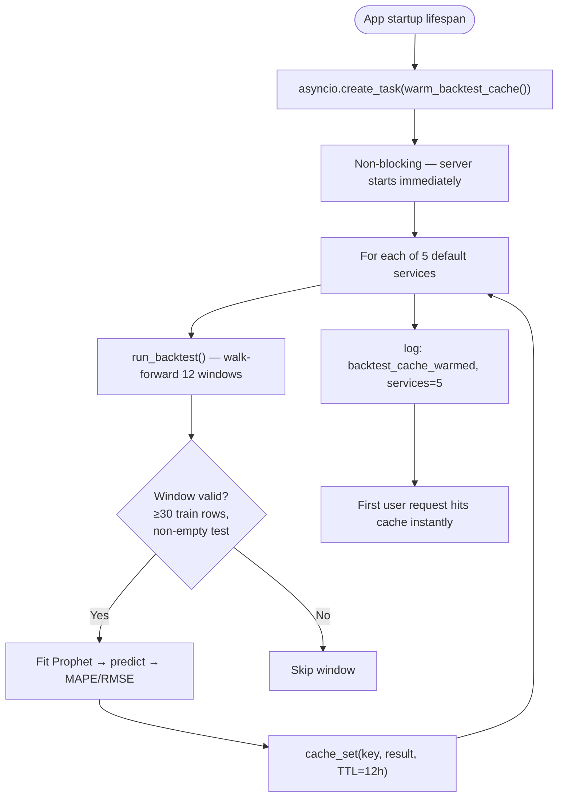

### Anomaly Detection Flow

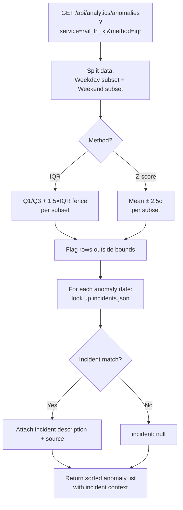

---

## 🚀 Getting Started

### Prerequisites

- Python `≥ 3.12`
- Node.js `≥ 18`
- Docker + Docker Compose *(recommended for backend — handles Prophet/pystan C++ build automatically)*

### Backend

```bash
cd backend

# Option A: Docker (recommended — Prophet C++ compiles at image build time)
docker build -t transitwehh-backend .
docker run -p 8000:8000 --env-file .env transitwehh-backend

# Option B: Local venv (~5–10 min first install — Prophet/pystan compile)
python -m venv .venv && source .venv/bin/activate
pip install -r requirements.txt
cp .env.example .env
uvicorn main:app --reload --port 8000
```

API docs available at `http://localhost:8000/docs` once running.

### Frontend

```bash
cd frontend
npm install
cp .env.example .env     # set VITE_API_BASE_URL=http://localhost:8000
npm run dev              # http://localhost:5173
```

---

## 🔑 Environment Variables

### Backend (`.env`)

```env
# App
FRONTEND_URL=http://localhost:5173
DEV=true

# Weather providers (priority order — all optional; Open-Meteo is free fallback)
XWEATHER_CLIENT_ID=
XWEATHER_CLIENT_SECRET=
METEOBLUE_KEY=
TOMORROW_KEY=
WEATHERAPI_KEY=

# Data source (public — no key required)
DATA_GOV_MY_BASE_URL=https://api.data.gov.my
```

> The dashboard works without any weather keys — Open-Meteo is the free fallback. Weather is only used for the rain regressor in Prophet forecasts.

### Frontend (`.env`)

```env
VITE_API_BASE_URL=http://localhost:8000
```

---

## ☁️ Deployment

| Service | Purpose |
|---|---|
| Vercel | Frontend (static build) |
| Railway | Backend (Dockerized — Prophet builds at image time) |

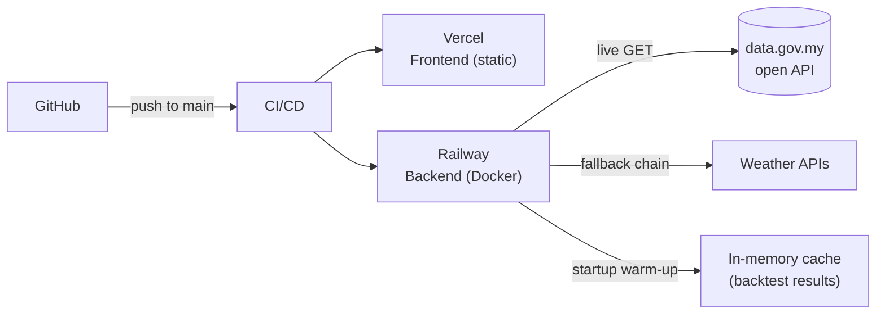

**Railway notes:**
- Set `FRONTEND_URL` to your Vercel domain — CORS is locked to this value
- `/api/health` is **exempt from rate limiting** — Railway pings it every 10–30s as a health check
- Prophet/pystan C++ compiles at `docker build` time, not at container start
- Set all optional weather API keys as Railway environment variables

---

## 📁 Project Structure

```
TransitWehh/
├── CLAUDE.md                     # Claude Code context
├── .gitignore
│
├── backend/
│   ├── Dockerfile                # Non-root appuser, Prophet builds at image time
│   ├── requirements.txt          # Fully pinned — prevents pystan build breaks
│   ├── .env.example
│   ├── main.py                   # CORS, rate limit handler, /api/health (EXEMPT)
│   ├── startup.py                # Non-blocking Prophet warm-up cache on boot
│   │
│   ├── routers/
│   │   ├── headline.py           # /api/headline/* (ridership data)
│   │   ├── ktmb.py               # /api/ktmb/*
│   │   ├── analytics.py          # /api/analytics/* (anomaly, forecast, backtest…)
│   │   ├── nowcast.py            # /api/nowcast
│   │   └── insights.py           # /api/insights, /api/annotations, /api/tools/*
│   │
│   ├── services/
│   │   ├── config.py             # ALL constants with rationale (single source of truth)
│   │   ├── data_fetcher.py       # Schema-validated fetch + stale-while-revalidate
│   │   ├── weather_fetcher.py    # 5-provider fallback chain + 24h cache
│   │   ├── transforms.py         # Forward-fill, date features, rolling avg, YoY, heatmap
│   │   ├── anomaly.py            # IQR + z-score, weekday/weekend-aware
│   │   ├── forecasting.py        # Prophet + MY holidays + rain regressor
│   │   ├── backtesting.py        # Walk-forward backtest (hard slice → no leakage)
│   │   ├── decomposition.py      # STL via statsmodels
│   │   ├── event_study.py        # Welch t-test pre/post event + plain-English verdict
│   │   ├── nowcast.py            # DOW × hour density, holiday-aware
│   │   ├── insights.py           # Auto-generated narrative insights
│   │   └── transforms.py
│   │
│   ├── models/
│   │   └── schemas.py            # Pydantic validators — bounded params (no URL abuse)
│   │
│   ├── middleware/
│   │   └── rate_limit.py         # Tiered slowapi: 60/30/10/EXEMPT
│   │
│   ├── utils/
│   │   ├── cache.py              # fetch_with_stale_fallback()
│   │   ├── holidays.py           # Malaysian public holidays (holidays lib)
│   │   └── logging.py            # structlog — JSON in prod, readable in dev
│   │
│   └── data/
│       ├── incidents.json        # Service disruptions → AnomalyFlag tooltips
│       ├── annotations.json      # Structural events → chart ReferenceLine markers
│       └── my50_fares.json       # Prasarana fare schedule → My50 calculator
│
└── frontend/
    ├── src/
    │   ├── types/transport.ts    # All TypeScript interfaces
    │   ├── lib/
    │   │   ├── constants.ts      # SERVICE_META, SERVICE_PRESETS, INDEX_BASE_DATES
    │   │   ├── utils.ts          # cn(), formatNumber(), toExportRow(), downloadCsv()
    │   │   ├── api.ts            # All typed API fetch functions (axios)
    │   │   └── theme.tsx         # ThemeProvider + useTheme dark mode
    │   ├── hooks/
    │   │   ├── use-headline.ts   # useKpis, useHeadline, useRolling, useYoy, useHeatmap…
    │   │   ├── use-analytics.ts  # useForecast, useBacktest, useAnomalies, useDecompose…
    │   │   └── use-misc.ts       # useNowcast, useInsights, useAnnotations, useMy50Fares…
    │   ├── components/
    │   │   ├── ui/               # Button, Card, Badge, Skeleton, Tooltip, Tabs
    │   │   ├── layout/           # Sidebar, Layout
    │   │   ├── charts/           # MultiLineChart, ForecastChart, HeatmapChart, etc.
    │   │   ├── dashboard/        # KpiCard, ServiceCard, NowcastBadge, ModelHealthBadge…
    │   │   ├── explorer/         # DataTable, QualityStats
    │   │   └── tools/            # My50Calculator
    │   └── pages/                # Overview, Trends, Compare, KtmbDeepDive, Insights,
    │                             # Predictions, Explorer, Privacy, Terms, NotFound
    └── [config]                  # vite.config.ts, tailwind.config.js, tsconfig.json
```

---

## 🗺 Roadmap

- [x] FastAPI backend — all 20 endpoints, tiered rate limiting, health check
- [x] 5-provider weather fallback chain with 24h cache
- [x] Prophet forecasting + rain regressor + MY holiday calendar
- [x] Walk-forward backtesting (leakage-free) + MAPE/RMSE tracker
- [x] IQR + z-score anomaly detection with incident context
- [x] STL seasonal decomposition
- [x] Event Study — MRT Putrajaya structural break analysis
- [x] Crowd nowcast — DOW × hour density, holiday-aware
- [x] Stale-while-revalidate cache + schema drift detection
- [x] React frontend — 7 pages, dark mode, all charts
- [x] My50 "Balik Modal" break-even calculator
- [x] CSV export with human-readable column names
- [x] Chart PNG download (html-to-image)
- [ ] KTMB monthly deep-dive page completion
- [ ] YoY comparison chart polish
- [ ] Fare hike date annotations + impact study
- [ ] Inter-service transfer correlation analysis
- [ ] My100 pass support in calculator
- [ ] Vercel + Railway deployment
- [ ] Automated annotation updates (new service openings, policy changes)

---

## 📄 License

[MIT](LICENSE) © 2026 TransitWehh / Wehh Series
